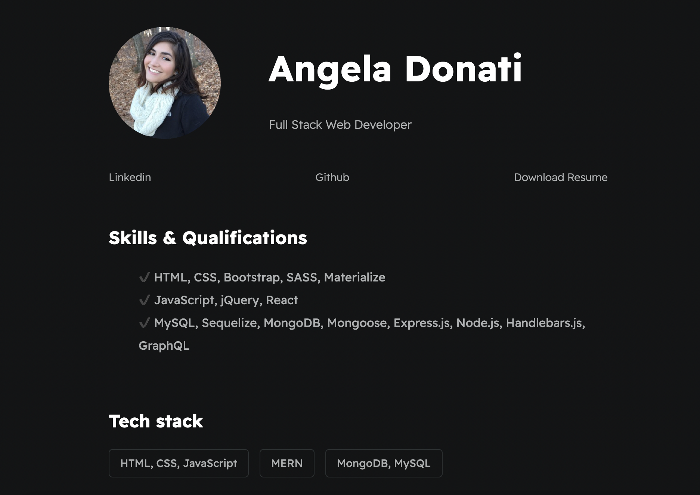

# a-donati-portfolio

## Description

Updated and most current personal portfolio page that has been redesigned to be more accessible and straight forward. 

## Usage

Page contains sections for bio, skills, work history and projects

[Click here for my deployed portfolio page](https://a-donati.github.io/a-donati-portfolio/)

## Questions

- Contact me via [email](mailto:angeladonati93@gmail.com)
- View my GitHub [profile](http://www.github.com/a-donati)
